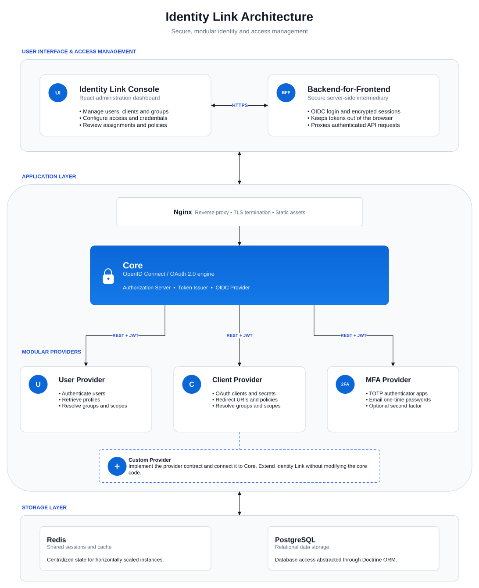

# Identity Link


[](https://github.com/sgoranov/identity-link/actions/workflows/phpunit.yml)
[](https://github.com/sgoranov/identity-link/actions/workflows/vulnerability-scan.yml)

Identity Link is a modular, extensible OAuth2 and OpenID Connect (OIDC) authorization
server built with Symfony and PHP. It provides a complete 
authentication and authorization solution designed for modern, 
distributed applications requiring token-based security.



## Why choose Identity Link

Identity Link is a modern identity management system built with 
scalability, flexibility, and security in mind. Key features include:

 - OAuth2 and OpenID Connect (OIDC) support
 - JWT access token issuance
 - Authorization Code, Client Credentials, and Password Grant flows
 - RESTful API for user, client, and group management
 - Modular architecture for pluggable components
 - Built-in TOTP two-factor authentication
 - Easy customization of UI, text, and translations
 - Docker-based development environment
 - Extensive PHPUnit test coverage

## Components

- [DB Clients](https://github.com/sgoranov/identity-link-db-clients) - Manages registered OAuth2 clients, secrets, and their access policies
- [DB Users](https://github.com/sgoranov/identity-link-db-users) - Handles user registration, storage, and authentication
- [2FA](https://github.com/sgoranov/identity-link-2fa) - Provides optional two-factor authentication via TOTP
- [Console](https://github.com/sgoranov/identity-link-console) - Administrative UI for managing users, clients, groups, etc.
- [BFF](https://github.com/sgoranov/identity-link-bff) - Backend-for-frontend that handles OIDC login, stores the user session, and proxies requests to backend services while attaching the access token
- [Shared](https://github.com/sgoranov/identity-link-shared) - Common utilities and abstractions shared across services
- [Docker](https://github.com/sgoranov/identity-link-docker) - Centralized Docker Compose setup to orchestrate all services

## Demo

A public demo environment is available for evaluating Identity Link and testing integrations.

* Identity Link Admin Console: [https://auth.isoftplus.com/admin-console](https://auth.isoftplus.com/admin-console)
* OpenID Connect Discovery: [https://auth.isoftplus.com/.well-known/openid-configuration](https://auth.isoftplus.com/.well-known/openid-configuration)

You can sign in to the admin-console demo environment using the following credentials:

```txt
Username: admin
Password: admin
```

The OpenID Connect Discovery endpoint exposes the provider metadata required by OIDC compliant clients and libraries, 
making it easy to integrate with the demo identity provider using the standard discovery mechanism.

## Deployment

For production deployments using Docker and Docker Compose, see the dedicated deployment repository:

- [Identity Link Docker deployment guide](https://github.com/sgoranov/identity-link-docker)

The Docker repository contains:
- Production Docker Compose configuration
- HTTPS certificate setup
- Secret generation
- Service provisioning
- Deployment and update instructions

## Development

Getting started with local development is straightforward. The project provides a Docker Compose-based  
development environment that automatically provisions all required services, installs dependencies, 
prepares the databases, and generates the necessary application keys.

For step-by-step setup instructions, see [the development guide](https://github.com/sgoranov/identity-link-docker/blob/develop/docs/DEVELOPMENT.md) in the Docker repository.

## Documentation

- [Authorization Model](docs/AUTHORIZATION_MODEL.md)
- [API Contract Interfaces](docs/API_CONTRACTS.md)
- [Theme Customization](docs/THEME_CUSTOMIZATION.md)
 
## License

Identity Link is open source software licensed under the [MIT License](LICENSE), which permits reuse, 
modification, and distribution with minimal restrictions.
